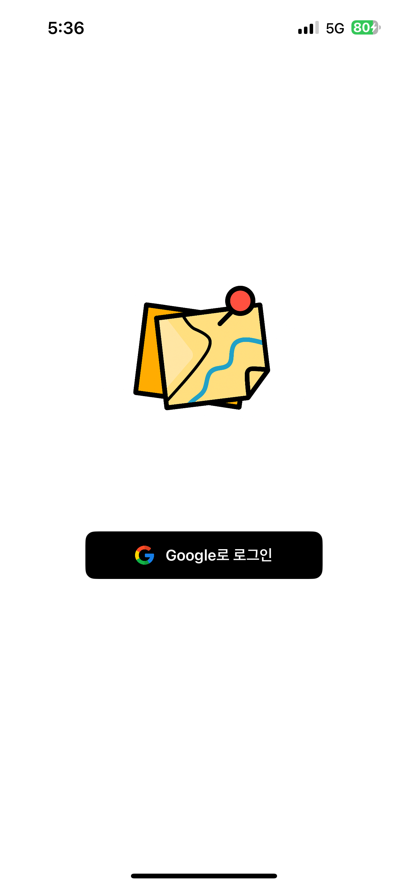
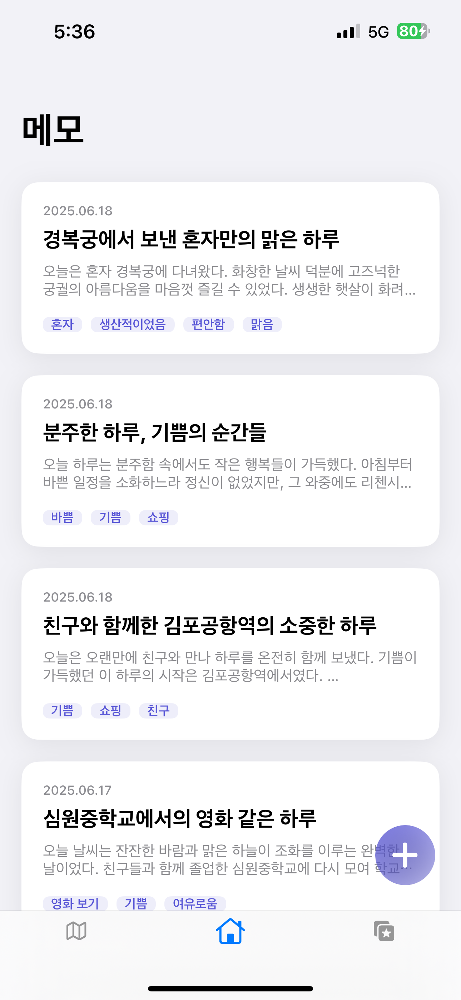
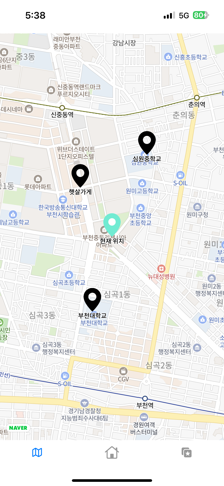
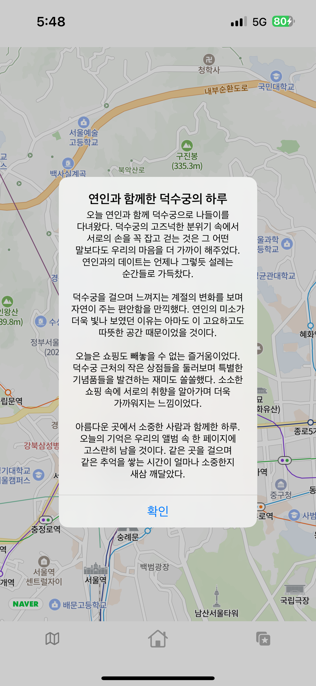
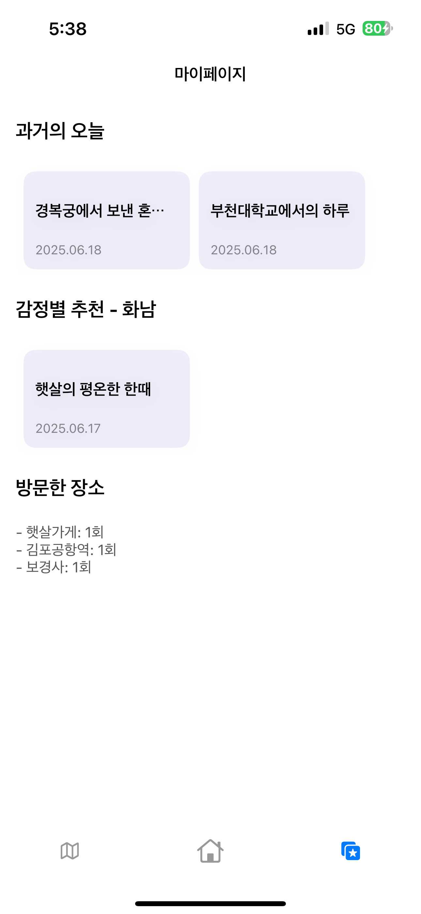
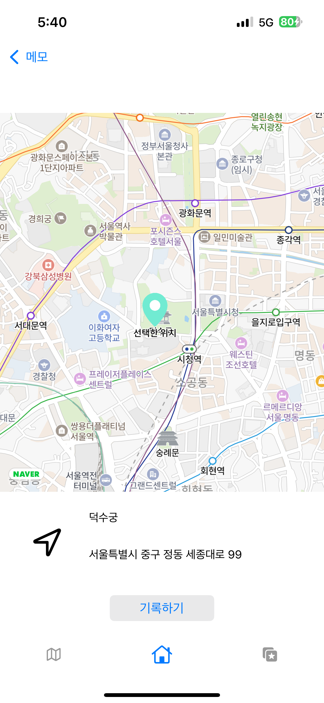
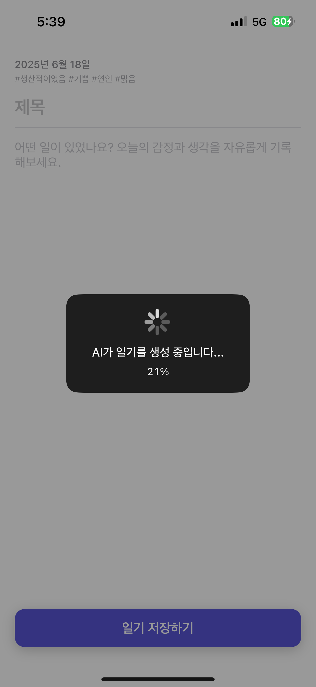
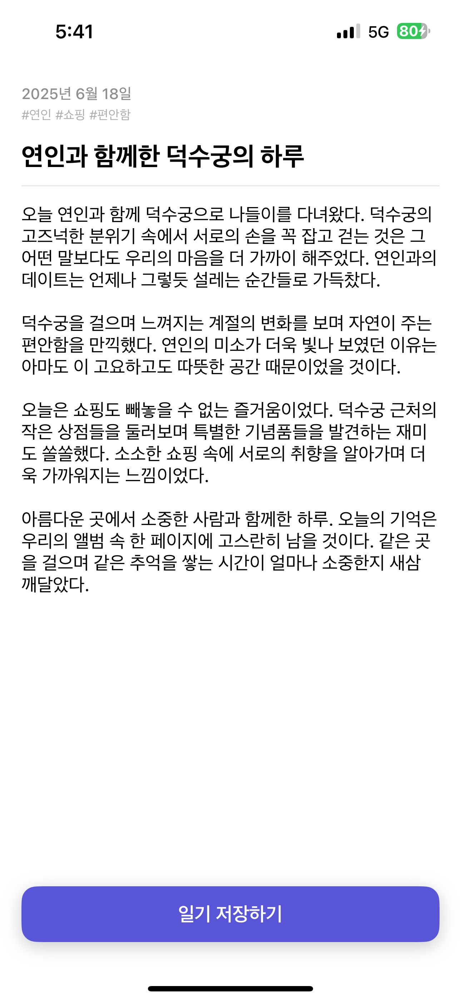
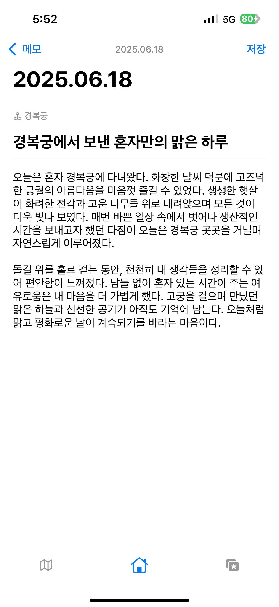

# MapMo
## 위치 기반 + 감정 기반 기록을 위한 AI 메모/일기 앱

## 📌 프로젝트 개요
gpt api를 이용한 사용자의 위치를 기반으로 작성된 메모나 일기를 기록하고,  
지도와 리스트를 통해 쉽게 관리할 수 있는 iOS 앱입니다.

## 🎯 프로젝트 목표
- 사용자가 지도에서 특정 위치를 선택하여 메모 또는 일기를 기록
- 기록한 메모들을 전체 목록 또는 지도에서 직관적으로 조회 가능하게 구성
- 단순한 기록이 아닌, 시간과 감정을 담은 추억으로 회고할 수 있도록 설계

## 🛠 핵심 기능

### ① 지도 기반 위치 선택
- `네이버 지도 api`를 활용해 사용자에게 지도를 시각적으로 제공  
- 현재 위치 또는 선택한 위치에 메모를 작성할 수 있음

### ② 메모 및 일기 작성/저장
- 사용자가 원하는 장소에 메모 또는 일기 작성 가능
- `Firebase`를 사용하여 데이터를 안전하게 저장

### ③ 감성 분류 후 사용자에게 제공
- 감성과 장소 별로 ‘추억’ 탭에서 관련 메모와 일기를 모아볼 수 있음

### ④ 바텀 탭바로 기능 구분
- 전체 메모 리스트 보기
- 지도 기반: 위치를 중심으로 메모/일기 작성 및 조회
- 추억 보기: 시간 기반 회고 콘텐츠 추천

---

## 🖼 주요 화면

<table>
  <tr>
    <td align="center"><b>1. 로그인</b>  구글 소셜 로그인</td>
    <td align="center"><b>2. 홈</b>  작성한 메모들 리스트</td>
    <td align="center"><b>3. 지도</b>  현재 위치 및 특정 위치에 메모 추가</td>
    <td align="center"><b>4. 지도 상세</b>  해당 위치의 일기 조회</td>
    <td align="center"><b>5. 감정별 추천</b>  감정 기반 기록 시작</td>
  </tr>
  <tr>
    <td align="center"><b>6. 위치 선택</b>  네이버 지도 api로 위치 선택</td>
    <td align="center"><b>7. 감정 선택</b>  원하는 감정과 한 일들 선택</td>
    <td align="center"><b>8. AI 생성</b>  gpt api로 일기 생성</td>
    <td align="center"><b>9. 일기 완성</b>  최종 완성된 일기 저장</td>
    <td align="center"><b>10. 일기 수정</b>  작성 된 일기 수정 화면</td>
  </tr>
</table>

---

## 🛠 주요 적용 기술

| 분류           | 내용 |
|----------------|------|
| **개발 언어**   |   |
| **개발 환경**   |   |
| **프레임워크** |   |
| **Open API**   |   |
| **클라우드 백엔드** |  |
| **버전 관리**   |   |

---

## 📹 시연 영상

> 앱의 핵심 기능과 전체 흐름을 영상으로 확인할 수 있습니다.

